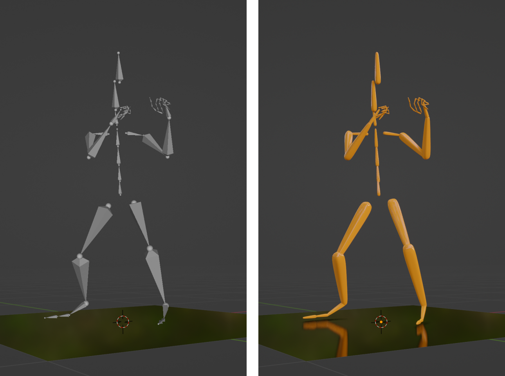

# Armature Proxy Mesh

A Blender add-on for easy creation of proxy meshes for a selected armature object

## Motivation

Animated armature objects (e.g., imported BVH motion capture data) cannot be rendered directly using Cycles or EEVEE unless they are skinned with meshes. This add-on adds renderable proxy meshes to armature objects for easy visualization.

## Usage

- Select an armature object in the current scene
- Push the "Add Mesh" button in the left pane of the 3D viewport

## Installation

- Download the latest release (a zip file) from the GitHub repository page
- Open Blender's Preferences window, go to the Add-on part, and specify the downloaded zip file for install

## Author

Yuki Koyama

## License

GPL-3.0
